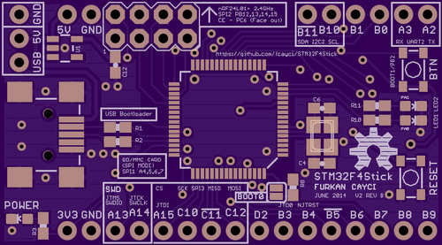

# STM32F4Stick - An STM32F405 based development board - Hardware

This board is intended to be a small bread-board friendly development environment for STM32F4 series microcontrollers. There are different versions some of which are not tested. Please contact me if you see any problems or have any suggestions.

Current Version Features:
* 1.84 x 1.02 inches board size
* STM32F405RG ARM Microcontroller
* 16 MHz HSE Oscillator
* MiniUSB connector for power/programming (through bootloader)
* SD Card slot connected in SPI mode
* nRF24L01+ 2.4GHz radio module compatible header
* 1 x 16-pin breakout header and 1 x 6-pin header on both sides for easy breadboard development
* 2 x LEDs + 1 Push button
* Reset button
* Optional pull-ups on pins A10, B5, B11, and C11 for reliable USB bootloader
* Jump pads on BOOT0 pin, and push button on BOOT1 pin (Also act as a GPIO pin)

## Hardware Versions

### Version 2
---
##### Top side:

##### Bottom side:

##### Changelog:
* Removed one of the 16-pin header, and added an 6-pin header instead
* Added 4x2-pin header for nRF24L01+ 2.4GHz radio connector

##### Pinout:

 Pin # | Pin Name | Functionality
------:|-----:|-------
 5  | PH0-OSC_IN | RCC_OSC_IN
 6  | PH1-OSC_OUT | RCC_OSC_OUT
 14 | PA0-WKUP | LED1
 15 | PA1 | LED2
 20 | PA4 | SPI1_NSS (SD Card)
 21 | PA5 | SPI1_SCK (SD Card)
 22 | PA6 | SPI1_MISO (SD Card)
 23 | PA7 | SPI1_MOSI (SD Card)
 28 | PB2 | BUTTON
 33 | PB12 | SPI2_NSS (nRF24L01+)
 34 | PB13 | SPI2_SCK (nRF24L01+)
 35 | PB14 | SPI2_MISO (nRF24L01+)
 36 | PB15 | SPI2_MOSI (nRF24L01+)
 37 | PC6 | CE (nRF24L01+)
 42 | PA9 | USB_OTG_FS_VBUS
 44 | PA11 | USB_OTG_FS_DM
 45 | PA12 | USB_OTG_FS_DP

### Version 1
---
##### Changelog:
* 1.84 x 1.02 inches
* STM32F405RG ARM Microcontroller
* 16 MHz HSE Oscillator
* MiniUSB connector for power/programming (through bootloader)
* SD Card slot connected in SPI mode
* 2 x 16-pin breakout headers on both sides for easy breadboard development
* 2 x LEDs + 1 Push button
* Reset button
* Pull-ups on pins A10, B5, B11, and C11 for reliable USB bootloader
* Jump pads on BOOT0 pin, and push button on BOOT1 pin (Also act as a GPIO pin)

##### Pinout:

 Pin # | Pin Name | Functionality
-----:|-----:|-------
 5  | PH0-OSC_IN | RCC_OSC_IN
 6  | PH1-OSC_OUT | RCC_OSC_OUT
 14 | PA0-WKUP | LED1
 15 | PA1 | LED2
 20 | PA4 | SPI1_NSS (SD Card)
 21 | PA5 | SPI1_SCK (SD Card)
 22 | PA6 | SPI1_MISO (SD Card)
 23 | PA7 | SPI1_MOSI (SD Card)
 28 | PB2 | BUTTON
 42 | PA9 | USB_OTG_FS_VBUS
 44 | PA11 | USB_OTG_FS_DM
 45 | PA12 | USB_OTG_FS_DP

## Future change notes

* TODO: Add a BOM for all versions
* TODO: Add a rendered picture of Version 1 board
* TODO: Change naming scheme from RevA/RevB to Ver1/Ver2 on the boards
* TODO: Add more info about the breakout pins
* TODO: Locate and connect DAC pins to the extension headers if they are broken out already
* POSSIBLE: Connect SD Card in SDIO mode
* POSSIBLE: Add an I2C compatible chip for an on-board I2C part. Possibly an MPU6050/9150 part if it fits
* POSSIBLE: Change to a Micro USB connector
